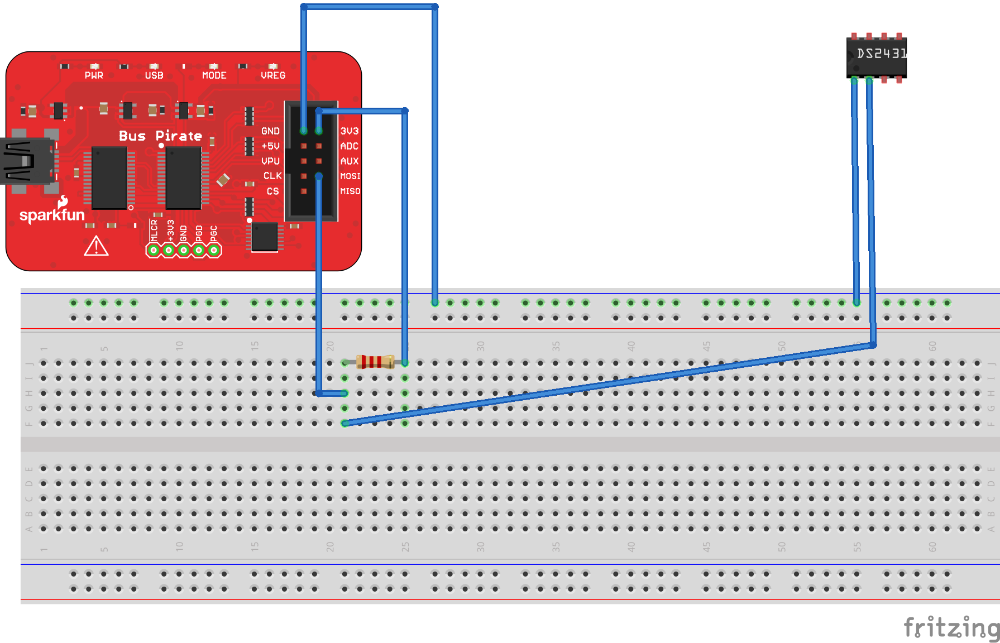

  [prompt engineer]: https://www.axios.com/2023/02/22/chatgpt-prompt-engineers-ai-job

# How To: Bus Pirate and DS2431

The following is a very quick summary of how to connect a DS2431 EEPROM chip to the Bus Pirate and read the first 8 bytes.

<!-- more -->

First, the following is the picture and Fritzing diagram of the connections using a breadboard, Bus Pirate, DS2431 and a 2.2K resistor:



### Prerequisites:

1. Linux (e.g. *Ubuntu* as that's what I used)
2. Terminal program (e.g. *Screen* as that's what I used)
3. Bus Pirate (I was using v3.6)
4. DS2431 EEPROM
5. 2.2k resistor
6. breadboard
7. 4 jumper wires (male to female)
8. Alligator clip
9. 1-2 IC wire test lead
10. USB for Bus Pirate (mine needed a mini-B)

### Steps:

1. Make all connections as shown in the diagram above.
2. Start Screen app:
````bash
sudo apt-get install screen
````
````bash
sudo screen /dev/ttyUSB0 115200
````
3. Press enter
4. Enter 'm' in the terminal to view options
5. Select '1-Wire'
6. Enter 'w' to turn on power
7. Enter 'v' to check voltage
8. Enter '(240)' to get a list of detected 1-Wire devices on bus
9. Enter '(0x55)(1) 0xf0 0x00 0x00 r:8 r:8' to read the first 8 bytes on the DS2431
