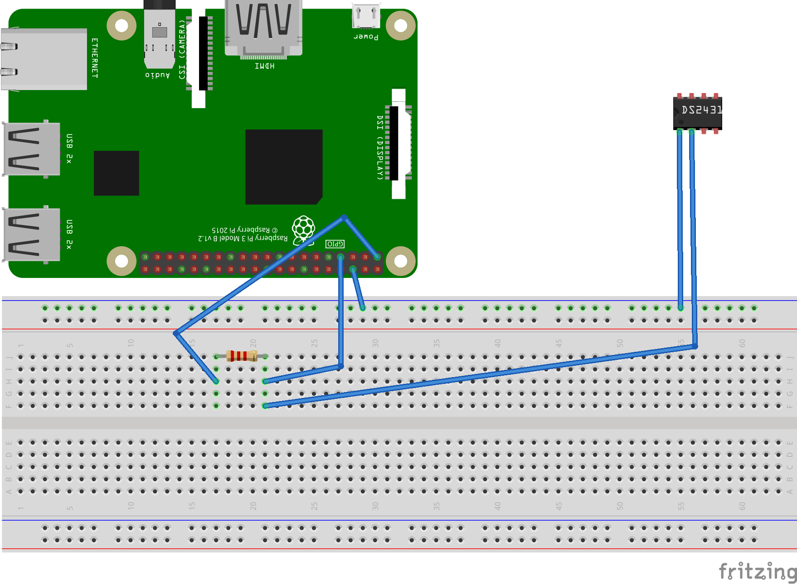

  [FTDI from Amazon]: https://www.amazon.com/gp/product/B00SK8LK1W/ref=ppx_yo_dt_b_search_asin_image?ie=UTF8&psc=1
  [post on Screen troubles]: https://unix.stackexchange.com/questions/238774/how-to-use-screen-as-a-serial-terminal-with-key-emulation-crlf-auto-mode
  [Adafruit FTDI schematics]: https://cdn-shop.adafruit.com/datasheets/FT232_Model.pdf

# Using an FTDI cable for UART comms

Today I'll be going over, briefly, how I used an [FTDI from Amazon] I bought for $23 to connect to the UART interface on a security camera I had also purchased from Amazon.

<!-- more -->

I had first tried this using a Raspberry Pi and the Screen app to connect to via UART and could not get it to work. One of the issues I was having was related to this [post on Screen troubles] someone else was trying to solve. After seeing this as a possible unsolved bug, I moved on to trying minicom and finally settled on what the OP on StackExchange had used: GTKTerm.

That is, I think that's what the OP had used. The OP called the app QTKTerm (which may exist, but I came up empty on a quick Brave search). Either way, GTKTerm worked well for me and was my solution. 

````bash
sudo apt-get install gtkterm
sudo gtkterm
````

!!! note GTKTerm Configuration
  You will need to go to 'Configuration' menu tab and then 'Port'.
  Change default port from '/dev/ttyS0' to '/dev/ttyUSB0' if needed.



Initially, when trying to figure out where the UART was on this camera board after taking it apart, I had seen the tell-tale 4 circuit board pads that might indicate a UART. I then took some readings with my multimeter and used what I had gleaned from some YouTube videos that ground would be found via a continuity check, transmit would be found by a floating voltage, VCC as a 3.3V reading and the receive as a 0V reading.

Using the steps from above, I tested the pads with the multimeter, but was only able to really identify ground. The remaining 3 pads all showed readings of 3.3V. Not sure what I was doing wrong there, but I moved on to checking the connections with a logic analyzer. Using the logic analyzer, I was able to pretty much confirm the presence of a UART signal at 11520 baud rate.
